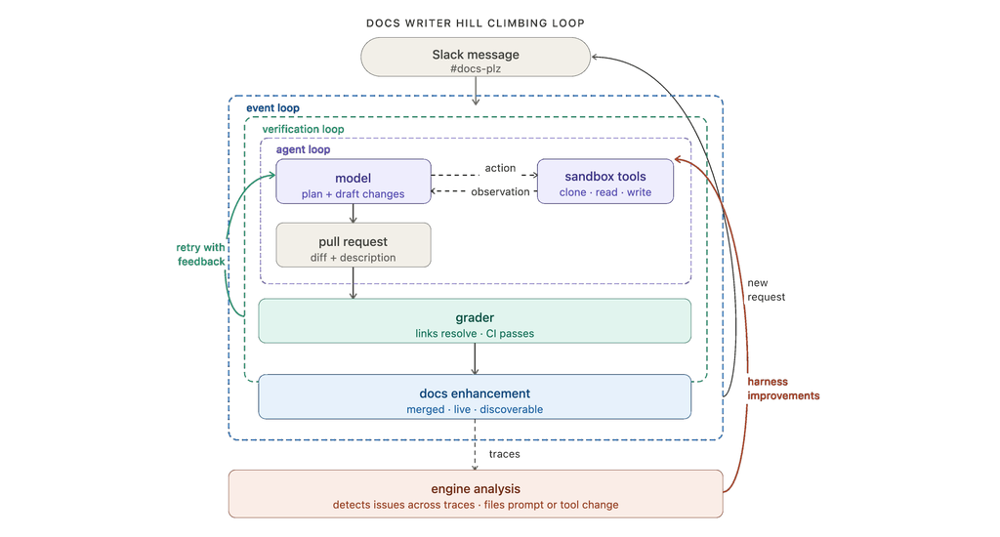
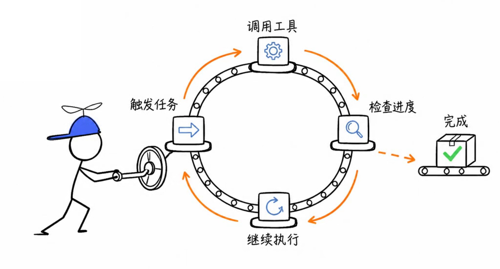
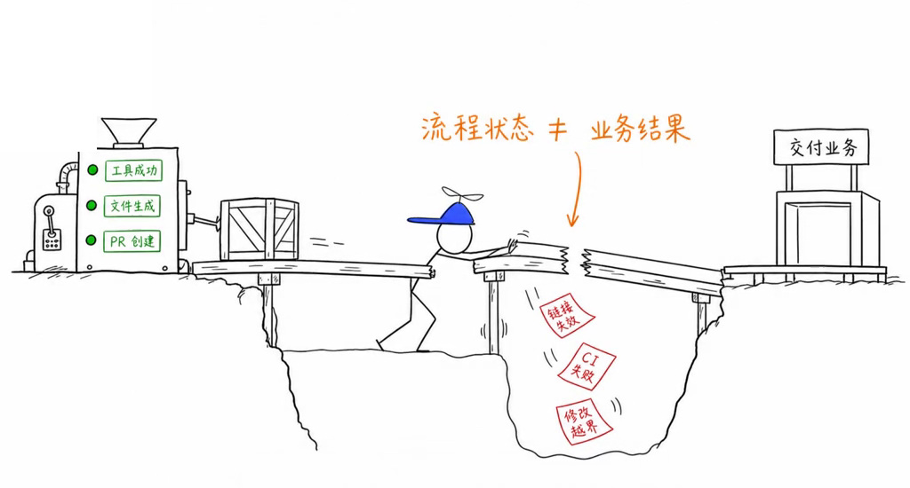
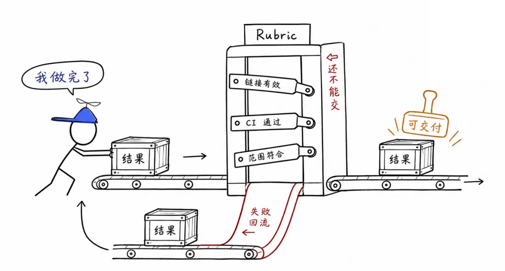
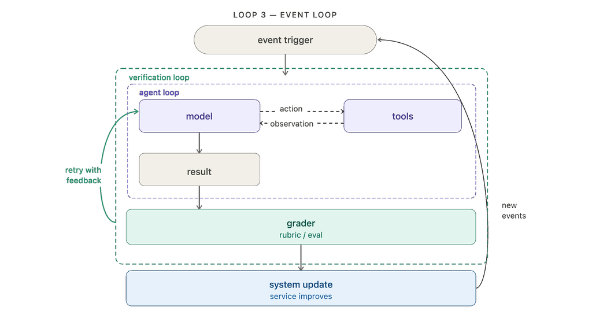
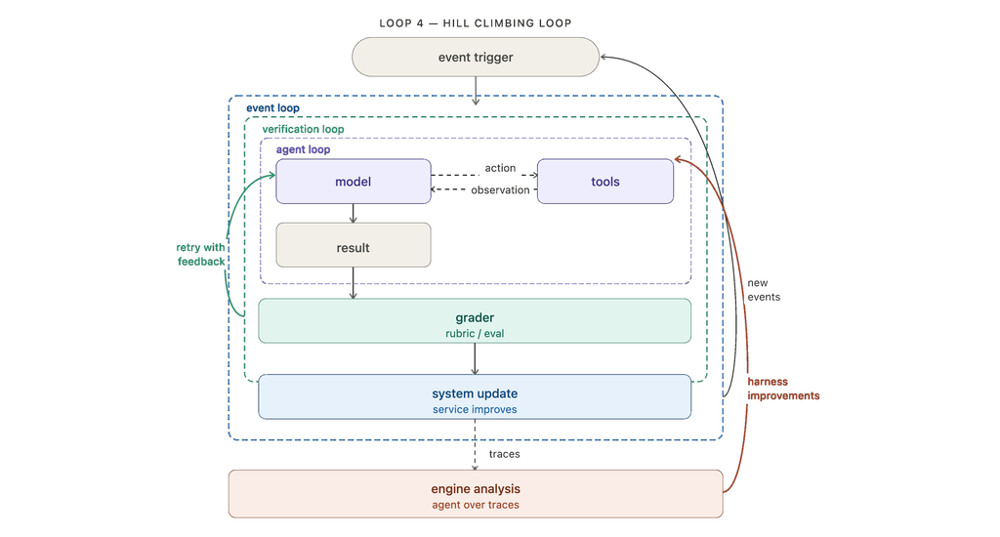
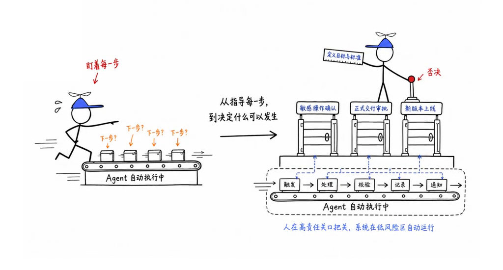

# Loop Engineering：让 AI 不只是干活，还能越干越好

原文：[The Art of Loop Engineering — LangChain](https://www.langchain.com/blog/the-art-of-loop-engineering)

Agent 生成了文件、创建了 PR，就算完成任务了吗？不一定：链接可能失效，CI 可能没过，改动也可能超出要求。

**持续执行、认为完成、真正可交付，是三件不同的事。** Loop Engineering 的重点，就是把执行、验收、业务触发和系统改进连接起来。

## 四层循环，一条生产线

| 循环 | 核心作用 | 生产线类比 |
| --- | --- | --- |
| Agent Loop | 调用工具，推进任务 | 干活的工位 |
| Verification Loop | 检查结果，失败后返工 | 质检门 |
| Event Driven Loop | 由事件持续触发任务 | 接单与调度 |
| Hill-climbing Loop | 从多次运行中改进系统 | 优化生产线 |

这四层不是四个并列功能，而是在不同范围内形成反馈：执行循环管任务里的行动，验证循环管本次交付，事件循环管持续发生的业务，改进循环管跨多次任务的系统演进。

就像工厂：工位能干活，质检能发现不合格品，调度让订单持续流转，而生产线改造才可能让同一种缺陷越来越少。

*原文完整案例：Slack 消息触发任务，结果通过验证后发布；运行轨迹再用于改进提示词和工具。*

## 1. 执行：机器会转，不等于产品合格

Agent Loop 让模型围绕目标反复调用工具、读取反馈，直到满足停止条件。

原文用内部文档 Agent 举例：接收需求后，克隆仓库、阅读代码、修改文档、检查 diff，最后创建 PR。

这里的“写文档”不只是生成文字。它要先确认代码实际如何工作，再判断现有文档哪里过时。工具让模型能够采取行动，环境反馈让它决定继续搜索、修改还是停下来。

但“PR 创建成功”只是流程状态，不能证明内容正确。就像下面这座断桥：左边的指示灯全绿，结果仍可能掉进链接失效、CI 失败和修改越界的坑里。

**流程成功，不等于业务成功。**

这个区别并不限于写文档：邮件发送成功，不代表发给了正确的人；报表生成成功，不代表数据口径正确。工具通常只能证明某个动作发生了，不能替业务证明目标已经达成。

## 2. 验收：“我做完了”只是申请，不是结论

Verification Loop 在执行之外加一道质检门：由 Grader（评估器）按照 Rubric（验收标准）检查结果，不合格就反馈原因、修复、再检查。

文档 Agent 的标准很具体：**链接有效、CI 通过、修改范围符合要求。**

失败反馈也要具体。“文档质量不够好”很难指导修复；“第三个链接返回 404”“只允许修改安装说明，却改动了 API 页面”，才让 Agent 知道下一轮应该解决什么。

关键不是多检查一遍，而是把“是否完成”的判定权，从执行者的自我判断移到明确的标准上。能用程序检查的就用程序；业务取舍和表达质量，则交给模型评估或人工评审。

不过，换一个模型来验收，也不天然意味着可靠。如果实现者和评估者都误解了需求，两者仍可能一起给出“通过”。因此，标准应提前定义，证据应来自实际结果，而不是实现者的解释。

工程上还要区分交付底线与优化项，并限制重试次数和预算。关键检查失败就停止交付；措辞还能更漂亮一点，则不一定值得无限返工。

## 3. 触发：不是加个定时器，而是接入业务

Event Driven Loop 让 Agent 不必等待用户打开聊天框。Slack 消息、Webhook 或定时任务，都可以触发执行。

*新事件持续进入，Agent 执行、验收，再把结果写回真实系统。*

它从一个“等人使用的功能”，变成业务中持续运行的节点。原文的文档 Agent，就是由指定 Slack 频道中的需求触发。

自动启动也意味着：过去由人发现的重复任务、缺失输入和异常，现在需要系统处理。必须明确**触发条件、输入、权限、去重与并发、失败恢复，以及何时转交人工**。

例如，同一条消息被投递两次，不能创建两个相同的 PR；两个任务同时修改同一份文档，需要避免相互覆盖；执行到一半失败，也要知道哪些动作已经完成，而不是从头重复造成二次影响。

这些属于业务运行机制，不是多写一句 Prompt 就能解决的。事件可以自动进入系统，但排队、权限、状态记录和人工接管仍要有明确规则。

## 4. 改进：别只修产品，要修生产线

如果 Agent 每次都扩大修改范围，每次都返工三轮才通过，任务虽然交付了，系统却没有进步。

Hill-climbing Loop 分析多次运行的 Trace（执行轨迹），找出重复失败，再调整 Harness——提示词、工具、上下文或评估器。例如，工具参数总被填错，就要检查工具接口是否足够清晰，而不是只修这一次的输入。

一条 Trace 能帮助排查故障，多条 Trace 才能暴露系统性问题：模型总在某一步缺少信息，某种任务总要多轮返工，或者评估器经常拒绝本来合格的结果。它记录的不只是“成功或失败”，还有理解、行动和反馈的过程。

*橙色箭头是关键：反馈不只是要求重做，而是改变下一次干活所依赖的环境。*

**验证循环修复这次结果；改进循环优化产生结果的系统。**

比如，Agent 反复扩大修改范围，验证循环会要求它撤回多余改动；改进循环则要追问：需求边界是否写清楚？工具是否允许任意目录写入？验收是否遗漏了范围检查？修改这些条件，才可能降低下一次犯错的概率。

原文的做法是从轨迹中发现问题，再创建 Issue 请求修改，并非让 Agent 随意重写自己后直接上线。视频补充的工程边界也很重要：候选改进应经过评测、回归测试和审核，并保留回滚能力。

如果验收标准本身错了，更多循环只会更快地走错方向。尤其不能把“通过率提高”直接当成质量提高：放松检查也能让数字变好看。改进后的配置，需要在固定的任务和标准下比较，确认没有牺牲真实质量。

## 人的角色：不盯每一步，守住关键的门

自动化不是把人移出循环，而是把注意力放到敏感操作、业务判断、正式交付和新版本上线这些高责任节点。

人从不断提醒“下一步怎么做”，转向**定义目标、验收标准和行动边界，并保留否决权**。

具体来说，转账、删除数据等敏感操作前要确认；内容是否适合客户、方案是否符合业务取舍，需要人的判断；结果正式对外交付或新配置上线前，可以设置审批。人不必替机器走每一步，但要能决定哪些门不能自动打开。

## 我的理解

Loop Engineering 的价值，不是让 Agent 多转几圈，而是让反馈产生不同层次的作用：执行反馈指导下一步，验收反馈修正这次结果，长期反馈改善整个系统。

这与 Harness 和控制论的思路是一致的：不只是要求执行者更认真，而是把目标、观测、判断和纠偏组织成可运行的机制。一次失败可以是返工成本，也可以成为下一版环境的改进依据，区别就在于反馈有没有被沉淀下来。

对低频、低风险的个人任务，执行加验收可能已经足够；任务进入持续业务后，再补事件调度；当重复错误积累到值得治理时，再建设改进循环。先解决当前瓶颈，比一开始堆齐四层更实际。

**循环不是越多越好。按业务需要扩展，并为每一层设置标准、预算和停止条件，才有可能让 Agent 从“会干活”走向“可靠交付”。**
